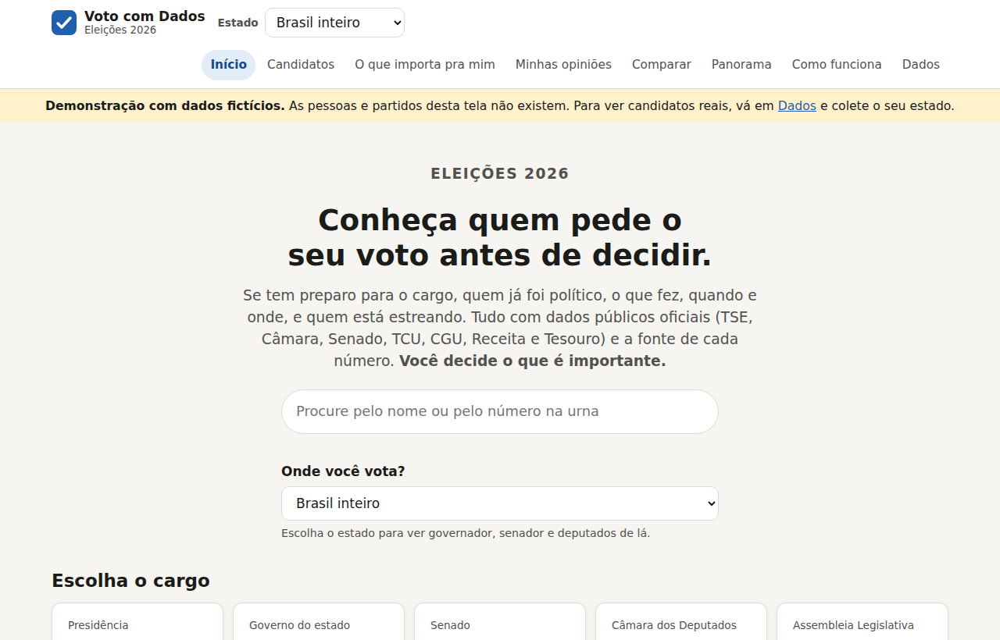
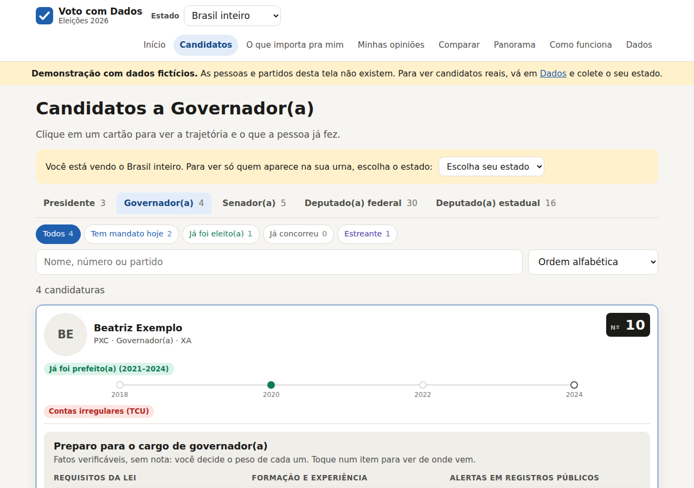
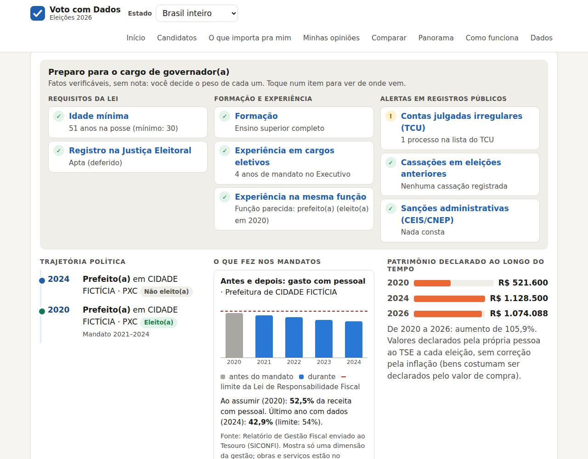
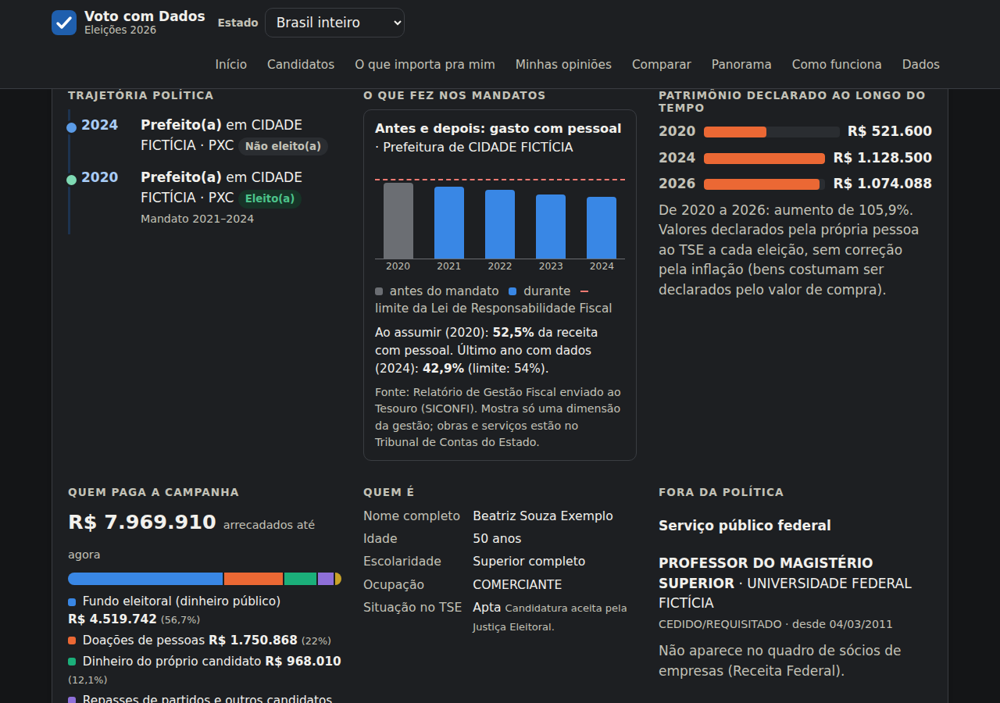
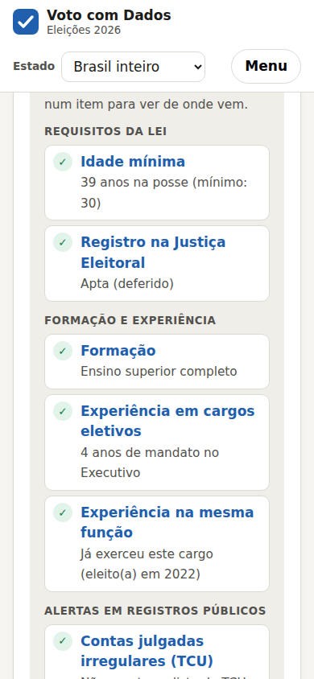

<div align="center">

# ☑️ Voto com Dados

**Conheça quem pede o seu voto antes de decidir.**

Um site que reúne dados públicos oficiais sobre **todas as candidaturas das eleições de 2026, no Brasil inteiro**,
e mostra, em linguagem simples, se a pessoa tem preparo para o cargo, o que já fez na política e de onde vem cada número.




</div>

> [!IMPORTANT]
> **O Voto com Dados não diz em quem votar.** Ele não dá nota à pessoa: organiza fatos verificáveis,
> mostra a fonte de cada um e deixa você decidir o que pesa mais.

---

## Por que existe

Na hora de votar, a maioria das pessoas conhece poucos candidatos além do nome e do número. As informações
existem (o TSE, a Câmara, o Senado, o TCU, a CGU, a Receita e o Tesouro publicam tudo em dados abertos), mas
estão espalhadas em dezenas de arquivos, com formatos técnicos e sem ligação entre si.

Este projeto junta essas fontes, liga cada candidatura às informações da mesma pessoa e responde às perguntas
que o eleitor faz de verdade:

- **Tem preparo para o cargo?** Idade mínima, formação e anos de experiência no mesmo tipo de função.
- **Já foi político? O que fez, quando e onde?** Mandatos anteriores, presença em votações, projetos, emendas
  e, para ex-prefeitos e ex-governadores, como estavam as contas antes e durante o mandato.
- **Tem algo que mereça atenção?** Contas rejeitadas pelo TCU, cassações e sanções administrativas.
- **Quem paga a campanha e como mudou o patrimônio?**

## O que você encontra

<table>
<tr>
<td width="50%"></td>
<td width="50%"></td>
</tr>
<tr>
<td><b>Candidatos em cartões.</b> Filtre por estado e cargo e veja de relance quem é estreante, quem já concorreu,
quem já foi eleito(a) e quem tem mandato hoje, com uma linha do tempo de 2018 a 2024.</td>
<td><b>Preparo para o cargo.</b> Requisitos da lei, formação, experiência e alertas em registros públicos.
São fatos com fonte, sem nota. Quando uma fonte não foi consultada, o site diz "não consultado", nunca "nada consta".</td>
</tr>
<tr>
<td width="50%"></td>
<td width="50%" align="center"></td>
</tr>
<tr>
<td><b>Antes e depois, patrimônio e financiamento.</b> Gasto com pessoal ano a ano em relação ao limite da Lei de
Responsabilidade Fiscal, bens declarados em cada eleição e a origem do dinheiro da campanha.</td>
<td><b>Funciona no celular e no tema escuro.</b></td>
</tr>
</table>

<sub>As imagens usam a base de demonstração: pessoas, partidos, cidades e empresas são fictícios.</sub>

### Na ficha de cada candidato

| Seção | O que mostra | Fonte |
|---|---|---|
| **Preparo para o cargo** | idade mínima na posse (Constituição, art. 14), situação do registro, escolaridade, anos de mandato no Executivo e no Legislativo, experiência na mesma função | TSE |
| **Trajetória política** | candidaturas de 2018 a 2024 (inclusive vereador e prefeito) e resultado de cada uma | TSE |
| **O que fez nos mandatos** | presença nas votações, projetos, aprovados e verba de gabinete; atuação no Senado | Câmara, Senado |
| **Emendas parlamentares** | quanto indicou e quanto foi pago, para quais cidades e áreas, parte em "emenda Pix" | Portal da Transparência |
| **Antes e depois** | ex-prefeitos e ex-governadores: gasto com pessoal em % da receita, ano a ano, com o limite da LRF | Tesouro (SICONFI) |
| **Patrimônio** | bens declarados em cada eleição disputada | TSE |
| **Quem paga a campanha** | fundo eleitoral, partido, doações, dinheiro próprio e vaquinha | TSE (prestação de contas) |
| **Fora da política** | empresas de que é sócio(a) e vínculo com o serviço público federal | Receita Federal, Portal da Transparência |
| **Registros que merecem atenção** | contas julgadas irregulares, cassações, sanções CEIS/CNEP | TCU, TSE, CGU |

### Outras páginas

| Página | Para quê |
|---|---|
| **O que importa pra mim** | você diz o que é importante (*Não importa / Importa / Importa muito*) e a lista se reorganiza na hora; opções avançadas com pesos de 0 a 10 e TOPSIS |
| **Minhas opiniões** | projetos já votados no Plenário, um por vez: *eu votaria SIM / NÃO*; mostra quem votou como você |
| **Comparar** | até 3 pessoas lado a lado |
| **Panorama** | quem são os candidatos: escolaridade, idade, experiência, bens, gênero, cor/raça |
| **Como funciona** | toda a metodologia e os limites, em linguagem simples |

## Começando

Você precisa do **Java 17 ou mais novo**. O Maven vem embutido no IntelliJ.

### No IntelliJ

1. **File › Open** e escolha a pasta do projeto (a que tem o `pom.xml`).
2. Confira o JDK em **File › Project Structure › SDK** (17+).
3. No seletor de execução (canto superior direito) já há três configurações prontas:
   - **1 - Abrir o site (localhost)**: abre `http://localhost:8080` com a **demonstração** (dados fictícios, sem internet).
   - **2 - Coletar dados do Brasil**: baixa e processa os dados reais do país inteiro.
   - **3 - Rodar os testes**.

### No terminal

```bash
mvn compile exec:java                                # abre o site com a demonstração
mvn package && java -jar target/decisao-eleitoral-0.2.0.jar coletar SE   # coleta um estado (mais rápido)
java -jar target/decisao-eleitoral-0.2.0.jar coletar BR                  # coleta o Brasil inteiro
java -jar target/decisao-eleitoral-0.2.0.jar web                         # abre o site com os dados coletados
```

| Comando | O que faz |
|---|---|
| `web [UF\|demo] [porta]` | sobe o site (porta 8080 ou a próxima livre) |
| `coletar BR\|UF [2026] [--sem-download] [--empresas]` | baixa e processa os dados; `--sem-download` usa só o que já está em `dados/brutos/`; `--empresas` baixa também o CNPJ da Receita (vários GB) |
| `ranking UF\|demo` | imprime um ranking com pesos iguais no console |

A coleta também pode ser feita **pelo próprio site**, na página **Dados**. A primeira coleta do Brasil inteiro
baixa alguns GB e pode passar de uma hora; depois tudo fica guardado em `dados/` e o site abre direto.

> [!TIP]
> Se o site do TSE recusar o download automático, baixe os `.zip` pelo navegador em
> <https://dadosabertos.tse.jus.br>, coloque em `dados/brutos/` sem renomear e rode `coletar ... --sem-download`.

## De onde vêm os dados

Todos os formatos foram **conferidos antes de escrever os leitores**, e nenhum dado é inventado.
Os detalhes de cada fonte (URLs, colunas, codificação e armadilhas) estão em **[docs/FONTES.md](docs/FONTES.md)**.

| Órgão | Arquivos usados |
|---|---|
| **TSE** | candidaturas, bens, cassações e prestação de contas de 2018 a 2026 |
| **Câmara dos Deputados** | votações, votos, proposições, autores, cota parlamentar, histórico de licenças |
| **Senado Federal** | API de dados abertos: mandatos, votações e autorias |
| **TCU** | lista de responsáveis com contas julgadas irregulares (Ficha Limpa) |
| **CGU / Portal da Transparência** | emendas parlamentares, CEIS, CNEP, servidores federais (SIAPE) |
| **Receita Federal** | quadro de sócios do CNPJ (opcional) |
| **Tesouro Nacional** | SICONFI: Relatório de Gestão Fiscal de estados e municípios |

## Princípios

- **Sem veredito.** Trajetória, preparo e alertas são contexto, não nota. O ranking só existe se você escolher os critérios.
- **"Sem dados" não é zero.** Quem não tem mandato não fica com nota ruim por isso.
- **Não consultado ≠ nada consta.** Se uma fonte faltou na coleta, o site diz isso.
- **Identidade com cuidado.** Ligações só por CPF, ou por nome completo + dígitos visíveis do CPF quando a fonte o mascara;
  ligações feitas só pelo nome aparecem com aviso para conferir. **O CPF não é gravado** nos arquivos processados.
- **Dados sensíveis fora.** Gênero e cor/raça só aparecem no Panorama agregado; filiação sindical não é tratada (LGPD);
  processos judiciais ficam de fora por não haver base aberta confiável.
- **Demonstração claramente fictícia.** Pessoas "Exemplo", partidos "PX", estados "XA/XB/XC".

## Como é feito

O núcleo é **Java puro, sem nenhuma biblioteca em tempo de execução** (JUnit só nos testes). O servidor é o
`com.sun.net.httpserver` do próprio JDK, e a interface é HTML, CSS e JavaScript sem framework.

```
arquivos públicos ──► coleta ──► CSV em cache (dados/processados) ──► indicadores e preparo ──► API JSON ──► site
```

```
src/main/java/br/unit/eleicao/
├── App.java          entrada: sobe o site ou roda a coleta
├── modelo/           Pessoa (abstrata) → Candidato, Deputado; Cargo, Elegibilidade, Financiamento, IndicadorFiscal…
├── preparo/          CriterioPreparo (abstrata) → 8 critérios; QuadroPreparo aplica todos
├── indicador/        Indicador (abstrata) → presença, verba, projetos, patrimônio, alinhamento
├── ranking/          MetodoRanking (abstrata) → SomaPonderada, Topsis
├── coleta/           um leitor por fonte (TSE, Câmara, Senado, TCU, emendas, CNPJ, CEIS/CNEP, SIAPE, SICONFI)
├── persistencia/     RepositorioArquivos: cache em CSV
├── excecao/          DadosException → ArquivoInvalidoException, ColetaException
├── util/             LeitorCsv, EscritorCsv, Texto, Estatistica, Xml
└── web/              ServidorWeb, ServicoApi, FichaComplementar, Json
src/main/resources/web/   index.html, estilo.css, app.js, metodologia.html
```

<details>
<summary><b>Projeto acadêmico: onde está cada conteúdo da disciplina</b></summary>

Feito para a disciplina **Projeto de Programação** (Java). O núcleo usa só o conteúdo do curso; a coleta e a
interface usam recursos padrão do JDK e da web.

| Conteúdo | Onde |
|---|---|
| Classes, encapsulamento, construtores, pacotes | `modelo/` (validação em `PosicaoUsuario` e `ConfiguracaoRanking`) |
| Herança | `Pessoa → Candidato/Deputado`, `Indicador → 5 indicadores`, `CriterioPreparo → 8 critérios`, `MetodoRanking → SomaPonderada/Topsis`, exceções |
| Polimorfismo / override | `avaliar` em cada critério de preparo; `calcular`, `formatar`, `resumir` em cada indicador; `equals`/`hashCode`/`toString` |
| Overload | `formatar(...)`, `resumir(...)`, `ArquivosBrutos.abrir(...)`, construtores |
| Enum | `GrauInstrucao`, `Elegibilidade`, `Cargo`, `Avaliacao`, `Sentido` |
| Exceções | exceções próprias, `try-with-resources`, `throw`, multi-catch |
| Arquivos | `LeitorCsv`/`EscritorCsv`, `Properties`, leitura de `.zip` em fluxo, JSON e XML |
| Coleções | `ArrayList`, `HashMap`, `TreeMap`, `LinkedHashMap`, `HashSet`, `Collections.unmodifiable…` |
| Strings | normalização de nomes, `split`, `format`, `StringBuilder`, regex |

</details>

## Testes

```bash
mvn test
```

São 55 testes. Eles cobrem estatística, leitura de CSV, cada indicador, ranking (soma ponderada, TOPSIS,
cobertura mínima), elegibilidade, cruzamento de identidades, o quadro de preparo e a coleta completa sobre
arquivos pequenos no **layout real** de cada fonte (TSE, Câmara, Senado, TCU, receitas, emendas, CEIS/CNEP,
SIAPE, CNPJ e SICONFI). Também testam o servidor web respondendo como o navegador.

## Limitações conhecidas

- A coleta completa ainda **não foi executada contra os servidores oficiais**: os formatos foram conferidos em
  documentação e arquivos publicados. Se uma coluna mudar de nome, a coleta para e diz qual coluna e qual arquivo.
- Mandatos em **assembleias e câmaras municipais** não têm base nacional padronizada: o site indica onde consultar.
- Empresas, sanções e serviço público dependem de o TSE publicar o CPF completo; quando vem mascarado, essas
  partes aparecem como "não consultado".
- O "antes e depois" mostra só a responsabilidade fiscal; indicadores de educação e saúde ficaram para depois.

## Contribuindo

Sugestões e correções são bem-vindas, principalmente:

- **Mudança de formato** em algum arquivo público (abra uma issue com o nome do arquivo e a mensagem da coleta).
- **Vínculo errado** entre pessoas: o arquivo `dados/vinculos_manuais.csv` (`sq;idDeputado`) corrige casos pontuais.
- Novas fontes **oficiais e abertas** que ajudem o eleitor a decidir. Veja em [docs/FONTES.md](docs/FONTES.md) as que já foram avaliadas.

Antes de abrir um pull request, rode `mvn test`.
